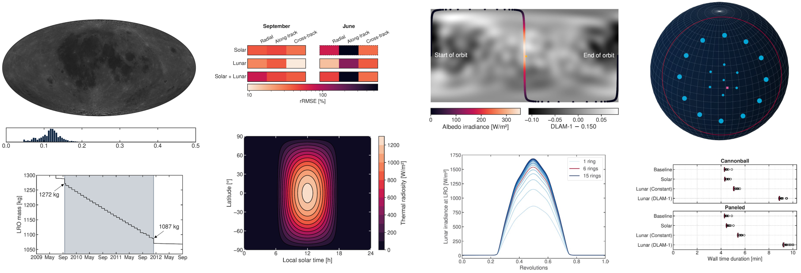

# High-accuracy radiation pressure models for the Lunar Reconnaissance Orbiter



This is the repository for the [Honours Programme Bachelor](https://www.tudelft.nl/en/student/faculties/ae-student-portal/education/bachelor/honours-programme/information-for-supervisors) (HPB) project of Dominik Stiller (dstiller@uw.edu) at TU Delft. The aim is to investigate the short-term effects of radiation pressure on the Lunar Reconnaissance Orbiter. The project is supervised by Dr. Dominic Dirkx (d.dirkx@tudelft.nl).

The simulations use the TU Delft Astrodynamics Toolbox [Tudat](https://docs.tudat.space/en/latest/). All models are implemented in the [feature/radiation_pressure_modeling branch](https://github.com/DominikStiller/tudat/tree/feature/radiation_pressure_modeling) of my Tudat fork and will be merged soon.

Links:
* See the [paper](paper/build/main.pdf) for a comprehensive overview of methods and results
* See the [final presentation](presentations/final_2023-08-31.pdf) for an overview of the motivation and key results
* See the [poster](poster/build/poster.pdf) for preliminary results
* See the [project plan](planning/build/main.pdf) for a somewhat outdated overview
* See the [references folder](references/) for any mentioned literature

Code structure:
* `simulations/`: C++ code for Tudat simulations
* `lropy/`: Python code to run the simulations and load outputs
* `analysis/`: Jupyter notebooks to analyze the simulations


## Abstract
Precision orbit determination for geodetic applications requires force models even for small perturbations. Radiation from the Sun and Moon is a significant source of perturbation in lunar orbits and inadequate modeling of radiation pressure can lead to large position errors. In this project, we investigated the short-term effect of radiation pressure on the Lunar Reconnaissance Orbiter (LRO), which has a position knowledge requirement of 50 m to 100 m in total and below 1 m radially. We compared models of varying complexity to determine the benefits and computational cost of high-accuracy radiation pressure modeling.

We found that
    (1) the accelerations differ greatly depending on the Sun position,
    (2) only a paneled spacecraft model can account properly for changing orientation and geometry of LRO, and
    (3) a constant-albedo model is sufficient for lunar radiation, which is dominated by the thermal component. A spherical harmonics model for lunar albedo increases computational cost with little gain in the attained accuracy.
If radiation pressure is neglected, the along-track position errors can be as large as 1100 m and the radial error varies periodically with an amplitude of up to 24 m, highlighting the importance of adequate force modeling to meet LRO's orbit determination requirements.

For more information, read the [paper](paper/build/main.pdf).


## How to run the simulations

1. Download the necessary SPICE kernels into `spice/lro/`.
2. Clone `https://github.com/tudat-team/tudat-bundle` and update submodules to latest versions.
3. Build Tudat with the following commands:
```
cmake -DCMAKE_PREFIX_PATH="${conda_path}" \
  -DCMAKE_CXX_STANDARD=14 \
  -DBoost_NO_BOOST_CMAKE=ON \
  -DCMAKE_BUILD_TYPE=Release \
  -DTUDAT_BUILD_TESTS=OFF \
  -DTUDAT_BUILD_WITH_JSON_INTERFACE=OFF \
  -GNinja \
  -S . -B build

cmake --build build
```
 * See the `tudat-bundle` readme for more details, particularly on setting up the Conda environment.
 * If you do not have write access to `/usr/local`, add `-DCMAKE_INSTALL_PREFIX=~/.local/usr/local` to the configure command. The `--prefix` option does not work with Tudat.
4. Install Tudat using `cmake --install build`.
5. Build the simulations using `simulations/build.sh`.
6. Create and activate a virtual environment, then install the packages from `requirements.txt`.
7. Change to `lropy/` directory and run `bin/run.sh` to run the simulation selected in `lropy/run/__main__.py`.
 * Set the environment variable `SPICE_BASE` to point to your `spice/` folder
8. Analyze the results using the notebooks in `analysis/`.

